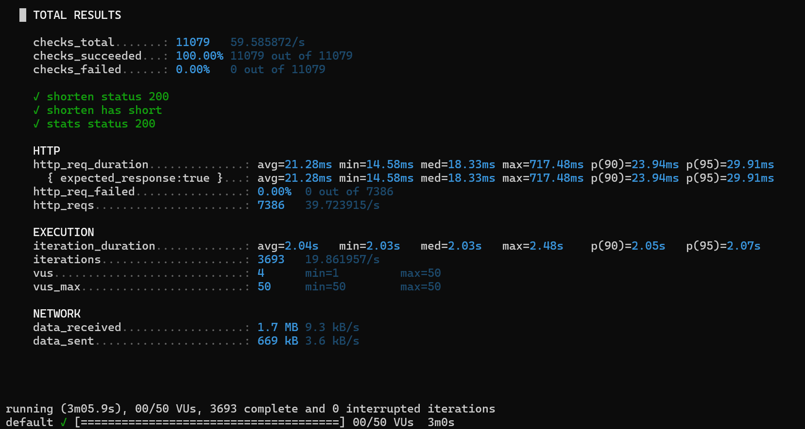
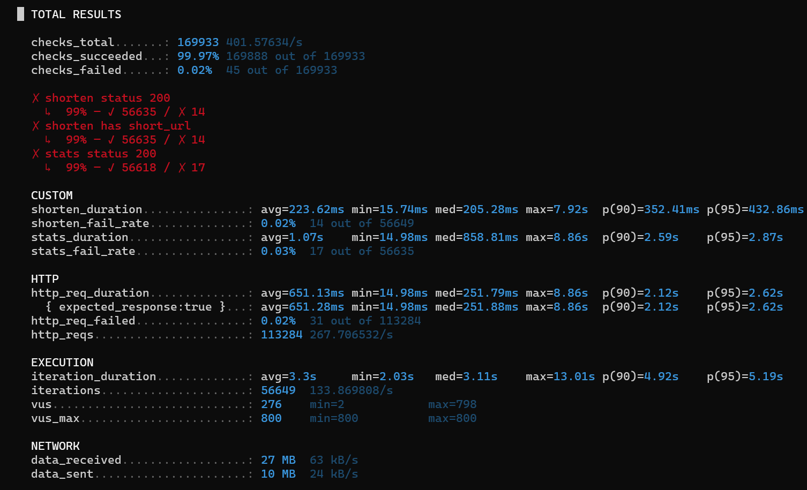
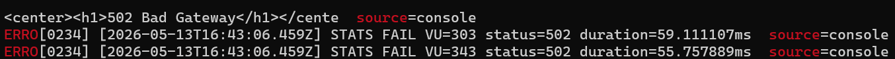
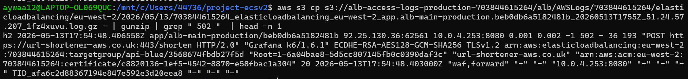
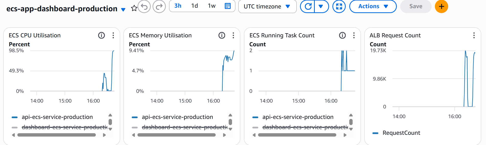
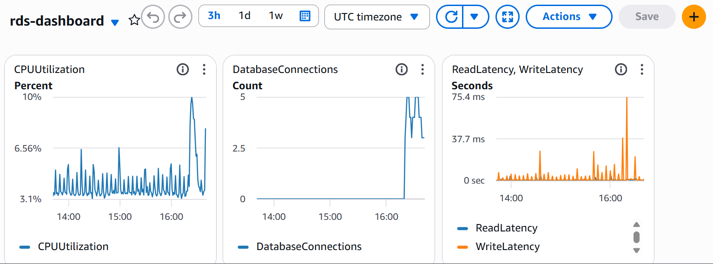
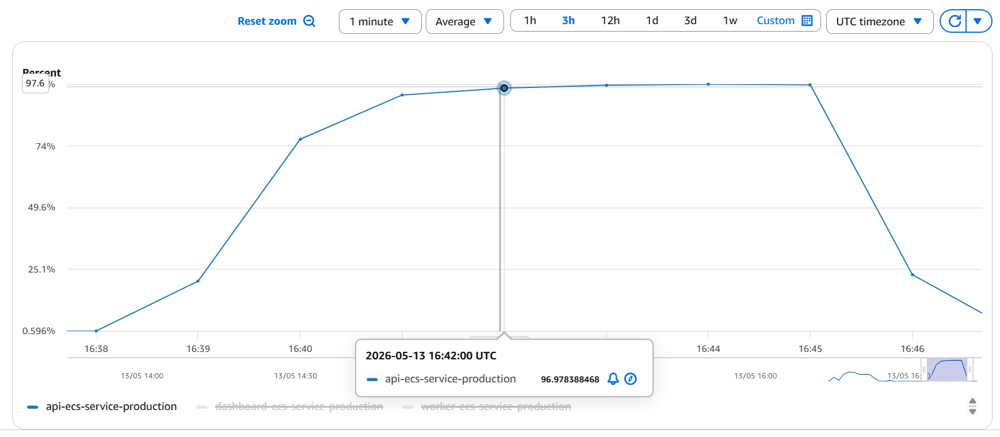

# Deployment Lifecycle

**Stack:** Python · Go · Docker · Terraform · AWS ECS (Fargate) · ALB · RDS (PostgreSQL) · ElastiCache (Redis) · SQS · CloudWatch · CodeDeploy · k6 · Cloudflare · GitHub Actions

---

## Overview

The deployment lifecycle progresses through four iterative phases in a structured environment: local, development, staging, and production.

Each phase incrementally introduces additional infrastructure that enhances security, observability, and deployment reliability. The objective is to validate the platform progressively at each phase rather than deploying the full production architecture at once.

| Phase | Environment | Objective |
|-------|-------------|-----------|
| 0 | Local | Validate application behaviour using Docker Compose |
| 1 | Development | Deploy minimal AWS infrastructure and verify ECS services |
| 2 | Staging | Validate new integrations, security, observability, and autoscaling |
| 3 | Production | Deploy highly available infrastructure with blue/green deployments and automatic rollback |

---

## Phase 0 — Local Environment

### Goal

The initial phase focuses on running the application locally using Docker Compose in order to validate:

- Understanding how services communicate
- Internal networking
- Port mappings
- Runtime dependencies
- Container startup behaviour

The significance of Docker Compose is that it establishes a blueprint for the AWS infrastructure before provisioning cloud resources. Networking decisions such as subnet design, security group rules, and ALB routing were derived directly from the Docker Compose architecture.

### Containerisation

The platform consists of three services written across two languages. Each service uses a multi-stage Docker build process to reduce image size, isolate build dependencies, and improve runtime security.

| Service | Language | Runtime Image | Reason |
|---------|----------|---------------|--------|
| `api` | Python | Alpine | Python requires runtime OS libraries for dependency resolution and PostgreSQL support |
| `dashboard` | Go | Distroless | Go compiles to a static binary with no runtime OS dependencies |
| `worker` | Go | Distroless | Go compiles to a static binary with no runtime OS dependencies |

### API Container (Python) — Multi-stage Build

| Stage | Actions |
|-------|---------|
| Stage 1 — Dependencies | Install system packages · Install Python dependencies via pip |
| Stage 2 — Builder | Copy source code · Compile Python bytecode |
| Stage 3 — Runtime | Install PostgreSQL runtime libraries · Create non-root user · Copy application artifacts · Configure container health checks · Expose port `8080` · Start application using `uvicorn` |

### Worker and Dashboard Containers (Go) — Multi-stage Build

| Stage | Actions |
|-------|---------|
| Stage 1 — Dependencies | Install system dependencies · Download Go modules |
| Stage 2 — Builder | Copy source code · Compile static binaries using `CGO_ENABLED=0` |
| Stage 3 — Runtime | Create non-root user · Copy compiled binary from builder stage · Start application binary |

### Container Security

All runtime containers:

- Run as non-root users
- Use minimal runtime images
- Include ECS-compatible structured logging
- Minimise attack surface through multi-stage builds

### CI Pipeline

```
GitHub Actions
   ↓
OIDC Authentication
   ↓
Docker Build
   ↓
Container Security Scan
   ↓
Push Images to Amazon ECR
```

**Security Design**

AWS authentication uses GitHub OIDC federation. No long-lived AWS credentials are stored in GitHub repositories, GitHub Actions secrets, or environment variables.

---

## Phase 1 — Development Environment

### Goal

The development environment acts as an infrastructure smoke test. The focus lies on getting the application running on real AWS infrastructure with minimal resources, making it easier in later phases when introducing additional resources for security and observability.

The objective is to verify:

- ECS task deployment running
- ALB routing
- Service-to-service communication
- Database connectivity
- CloudWatch logging for ECS containers

### Infrastructure Provisioned

| Module | Resources |
|--------|-----------|
| Networking | VPC, public/private subnets, route tables, NAT gateway, security groups, VPC endpoints |
| IAM | ECS task execution roles and task roles |
| CloudWatch | ECS log groups |
| SQS | Queue and dead-letter queue |
| ECS | Cluster, task definitions, and ECS services |
| ALB | Application Load Balancer, listeners, and target groups |
| RDS | PostgreSQL database in private subnet |
| Redis | ElastiCache Redis instance in private subnet |

### Validation Criteria

The development phase is considered complete when:

- All ECS services reach `RUNNING`
- ALB health checks pass successfully
- Services communicate successfully
- Logs appear in CloudWatch

---

## Phase 2 — Staging Environment

### Goal

The staging environment mirrors production as closely as possible. This phase introduces security hardening, observability, autoscaling, HTTPS, load testing, and IAM least privilege review.

The purpose of staging is to identify integration, networking, IAM, and deployment issues before production rollout.

### Additional Resources Introduced

| Resource | Purpose |
|----------|---------|
| Secrets Manager + KMS | Encrypt sensitive application secrets using a customer-managed KMS key |
| Cloudflare DNS | Route external traffic to the ALB |
| ACM Certificate | Enable HTTPS for the staging domain |
| AWS WAF | Protect the ALB using AWS managed rule sets |
| CloudWatch Dashboard | Centralised monitoring for ECS, ALB, and RDS metrics |
| CloudWatch Alarms | Trigger operational alerts and deployment rollback conditions |
| k6 Load Testing | Validate system behaviour under sustained load |
| ECS Autoscaling | Configure scaling policies using observed k6 metrics |
| IAM Least Privilege | Reduce task permissions to minimum required access |

### Load Testing

k6 load testing was performed against the API ECS service to evaluate request latency, error rates, ECS CPU utilisation, RDS performance, ALB request handling, and autoscaling thresholds.

#### k6 Test Results

| Test | Scenario | VUs | Avg Latency | p95 Latency | Error Rate | CPU Peak |
|------|----------|-----|-------------|-------------|------------|----------|
| Baseline | 50 VUs for 3 minutes | 50 | 20ms | 33ms | 0% | <1% |
| Ramp Test | Ramp from 250 to 800 VUs | 800 | 60ms | 204ms | 0.03% | 63% |

##### k6 first load test


##### k6 second load test


##### Timestamp Analysis

The first 502 error was captured in the k6 console at **16:43:06 UTC**. 
This timestamp was used to:

- Locate the exact ALB access log file in S3
- Correlate the failure against ECS CPU CloudWatch metrics
- Confirm the exact moment the bottleneck appeared



| Event | Time (UTC) | Detail |
|-------|------------|--------|
| Test started | 16:39:00 | 0 VUs |
| CPU reached 97% | 16:42:00 | ~400 VUs — container saturated |
| First 502 error | 16:43:06 | 234 seconds into test |
| Breaking point | ~500 VUs | 62.5% of max load |
| CPU peak | 16:45:00 | 98.2% at 700–800 VUs |
| Test ended | 16:46:00 | Load ramp-down complete |


### ALB Access Log Findings
The ALB access log was retrieved using the timestamp captured when the first 
502 error appeared. ALB logs provide more detail than CloudWatch, it enables me to pinpoin 
whether the failure stemed from the ALB or the ECS target. This is the first 
step taken when diagnosing any latency or 502 errors.

| Field | Value | Description |
|-------|-------|-------------|
| `elb-status-code` | `502` | ALB returned Bad Gateway |
| `target-status-code` | `none` | ECS task returned no HTTP response |
| `response-processing-time` | `-1` | ALB received no response from target |
| `target-processing-time` | `0.161` | ECS task dropped connection after 161ms |
| `request` | `POST /shorten` | Endpoint affected under load |
| `target` | `10.0.4.164:8080` | Single ECS task became saturated |




### Infrastructure Analysis

| Component | Metric | Value | Verdict |
|-----------|--------|-------|---------|
| RDS | CPU Utilisation | < 10% | Database not CPU constrained |
| RDS | Active Connections | ~5 | No connection exhaustion |
| RDS | Read/Write Latency | < 20ms | Latency remained healthy |
| ECS | CPU Utilisation at Failure | ~97% | ECS task became CPU saturated |
| ECS | Memory Utilisation | ~8% | No memory pressure |
| ALB | Peak Request Count | ~19.7K | High concurrency sustained |d

##### ecs dashboard metrics 


##### rds dashboard metrics 


#### timestamp cross-reference  
at current time 502 appeared marked it against the the cpu metrics which was at 95%, at this rate is where bottleneck appeared and latency was shown. 



### Diagnosis

Load test results show the primary bottleneck was the ECS API service.

The first 502 error timestamp matched the moment ECS CPU spiked to ~95–97%.

ALB access logs confirmed the ECS task accepted connections but failed to return responses.

RDS metrics remained healthy, ruling out the database as a bottleneck.

Memory usage was low, ruling out memory pressure.

Only the ECS API CPU showed critical saturation.

### Autoscaling Decisions

Autoscaling thresholds were configured using observed k6 behaviour rather than estimates.

| Threshold | Action | Justification |
|-----------|--------|---------------|
| 75% CPU | CloudWatch alarm trigger | Early warning before degradation |
| 80% CPU | ECS scale-out trigger | Increase capacity before saturation |
| 85% CPU | Scale-in evaluation threshold | Prevent aggressive scaling oscillation |


The API service handles URL shortening, database interaction, request routing, 
and business logic. therefore, applying autoscaling to only to the API service is valid. This is due to both worker and dashboard services maintains predictable traffic patterns which do not require scaling.

---

## Phase 3 — Production Environment

### Goal

The production environment introduces high availability, deployment safety, rollback automation, and operational resilience. Production deployments use ECS blue/green deployments through AWS CodeDeploy.

Blue/green deployment was selected over rolling deployments to minimise rollback time and reduce user impact during failed releases.

### Production Resources

| Resource | Purpose |
|----------|---------|
| CodeDeploy | Manage blue/green ECS deployments |
| Blue/Green Target Groups | Enable zero-downtime traffic shifting |
| CloudWatch Alarms | Trigger automatic rollback during unhealthy deployments |
| ALB Routing Rules | Route traffic between blue and green target groups |
| RDS Backups | Enable 7-day retention and snapshot recovery |

### Blue/Green Deployment Strategy

**Blue Environment** — Current production ECS task set actively serving traffic.

**Green Environment** — New ECS task set running the updated container image.

**Deployment Flow**

```
1. ECS deploys a new green task set
2. ALB health checks validate green task health
3. CodeDeploy shifts traffic from blue to green
4. Blue tasks remain active for a 5-minute termination window
5. Blue task set is terminated after successful deployment validation
```

```
Deployment Strategy:   Blue → Green
Traffic Shift:         ECSAllAtOnce
Termination Wait Time: 5 minutes
```

### Rollback Behaviour

If CloudWatch alarms enter `ALARM` state or health checks fail during deployment, CodeDeploy automatically redirects traffic back to the blue environment, failed green tasks are terminated, and rollback occurs with zero downtime. No manual intervention is required.

---

## Key Engineering Decisions

### OIDC Authentication for CI/CD

GitHub Actions authenticates to AWS using OIDC authentication. This removes the need for long-lived IAM credentials and reduces the risk of credential leakage through repositories, CI variables, or logs. AWS issues temporary credentials through IAM role assumption.

### Customer-Managed KMS Keys

Secrets Manager uses a customer-managed KMS key to encrypt database credentials and sensitive application configuration. This approach provides IAM access control, audit visibility through CloudTrail, and the ability to immediately revoke keys through KMS.

### Load Testing Before Autoscaling

Autoscaling thresholds configured without performance testing are assumptions. By performing k6 load testing before enabling autoscaling, the policies are aligned with observed behaviour rather than estimates. Testing provided visibility into ECS CPU utilisation, memory behaviour, request throughput, RDS connection handling, and ALB behaviour under sustained concurrency. With accurate baselines, scaling policies are tuned using measured infrastructure behaviour, which improves reliability.

---

## Outcome

The final production architecture delivers:

| Capability | Detail |
|------------|--------|
| Containerised Deployment | Multi-service Docker deployment across Python and Go |
| Secure Secret Management | Secrets Manager with customer-managed KMS keys |
| Private Networking | Services isolated in private subnets with VPC endpoints |
| HTTPS Encryption | ACM certificates with Cloudflare DNS |
| Blue/Green Deployments | Zero-downtime releases via CodeDeploy |
| Automatic Rollback | CloudWatch alarm-triggered rollback |
| ECS Autoscaling | CPU-threshold-based horizontal scaling for the API service |
| Centralised Observability | CloudWatch dashboards, alarms, and log groups |
| Infrastructure-as-Code | Full Terraform provisioning |
| Automated CI/CD | GitHub Actions pipeline with OIDC authentication |
