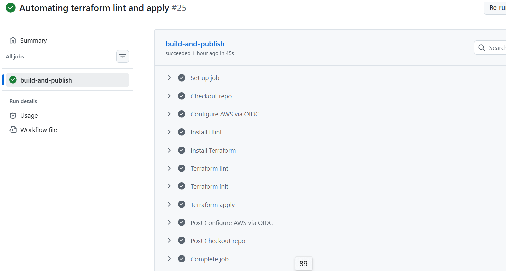
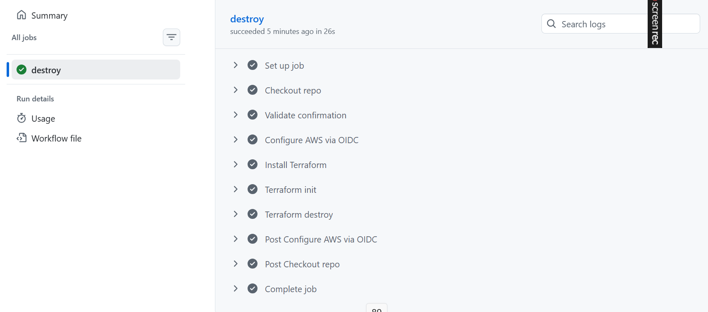
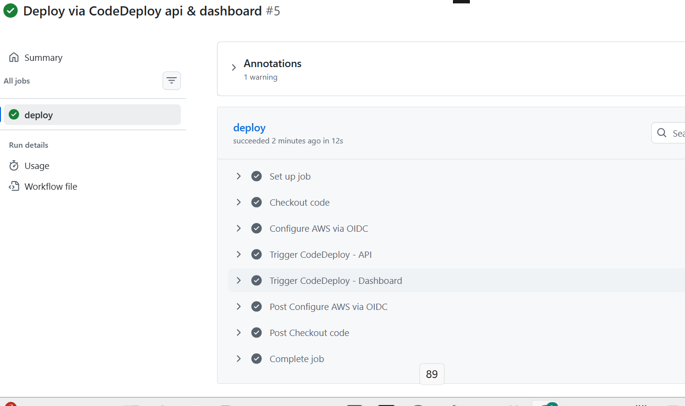
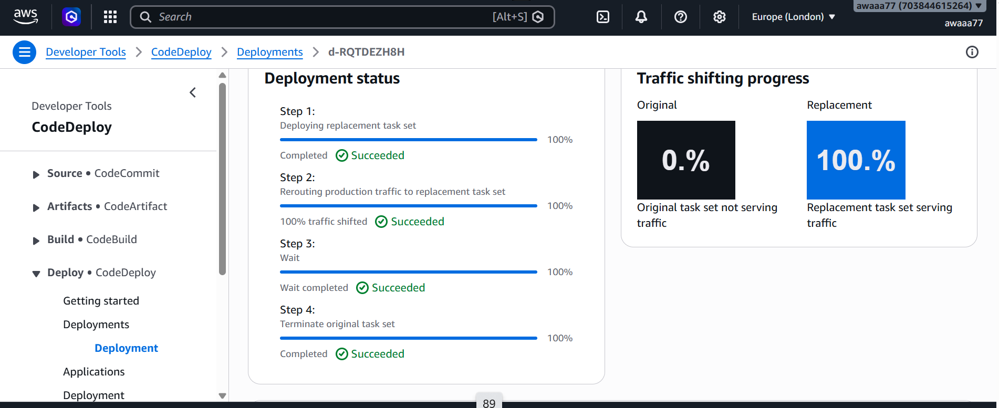

# ECS v2 — Production AWS Infrastructure

**Python · Go · Docker · Terraform · AWS ECS Fargate · ALB · RDS (PostgreSQL) · ElastiCache (Redis) · SQS · Secrets Manager · KMS · WAF · CodeDeploy · CloudWatch · k6 · GitHub Actions · Cloudflare**

End-to-end depeloyment of a distributed system deployed onto AWS Cloud. The project covers the full delivery lifecycle, from local Docker Compose through to a zero-downtime production deployment with automated rollback and centralised observability, provisioned entirely through Terraform and deployed via an automated CI/CD pipeline.

---

## Services
The system functions as a URL shortener and consists of three services that run independently while sharing the same ECS Fargate cluster and PostgreSQL database

| Service | Language | Port | Description |
|---------|----------|------|-------------|
| api | Python | 8080 | Shortens URLs, handles redirects, tracks clicks, publishes events to SQS |
| worker | Go | |Polls SQS for click events and writes analytics to PostgreSQL. Enables asynchronous communication and decouples analytics from the API and Dashboard. |
| dashboard | Go | 8081 | Analytics API — top URLs, click stats, hourly breakdowns, recent events |

---

## Documentation

| Document | Covers |
|----------|--------|
| Deployment Lifecycle | Four-phase delivery process — local, dev, staging, and production also including CI/CD pipeline configuration, k6 load test findings, and key infrastructure decisions.Provides a clear breakdown of how the project was delivered in progressive phases, with each stage building on the previous one to increase security and reliability |
| Architecture README | Full infrastructure reference covering networking, compute, data, autoscaling, blue/green deployment, observability, security, cost decisions, and Terraform module structure |

## Live Demo 

URL shortener operating live with DNS configured through Cloudflare and HTTPS enabled via ACM for secure end-to-end secure network traffic.

## CI/CD Pipeline
The project includes four GitHub Actions workflows, each responsible for a specific part of the delivery lifecycle.

### ci.yml — Build & Push

[[ci.yml](assets/ci_yml.png)]

Build container images

Security scan

Push to ECR

Register new task definition

### iac.yml — Infrastructure Apply

]

terraform init (remote backend)

terraform lint / testing tf files 

terraform apply

### iac-destroy.yml — Safe Teardown

]

Two‑step confirmation

Prevents accidental deletion of infrastructure

### codedeploy.yml — Blue/Green Deployment

]

Triggers CodeDeploy for API and Dashboard

Executes zero‑downtime blue/green rollout

Automated rollback on failed health checks
 ]

All credentials are stored in AWS Secrets Manager and AWS configuration is done through AWS OIDC. No hard coded credentials or key phreaes.
