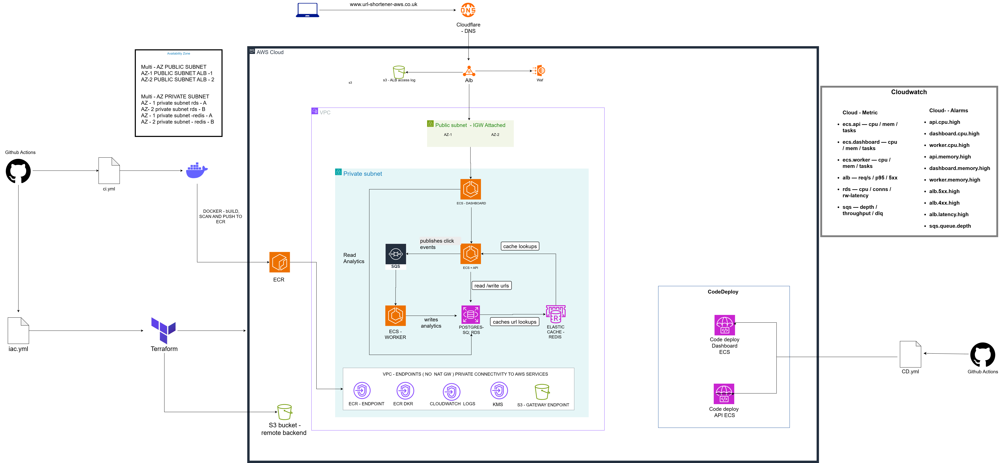

# Architecture

**Stack:** Python · Go · Docker · Terraform · AWS ECS (Fargate) · ALB · RDS (PostgreSQL) · ElastiCache (Redis) · SQS · CloudWatch · CodeDeploy · k6 · Cloudflare · GitHub Actions

---

## Overview

Multi-service infrastructure on AWS, full architecture design and resource documentation provisioned on Terraform.

**Covers**

- Architecture design
- Networking
- Compute
- Observability
- Security
- Reliability
- Terraform structure

97 resources are provisioned in Terraform to bring a highly available, reliable, and secure infrastructure that aligns with modern standard ECS Fargate deployment. This README serves as a reference for all resources deployed onto AWS.

---

## Architecture Diagram



Visual representation of the cloud architecture — covers the hierarchy from user endpoint to application, capturing the dynamic design of how the system operates.

---

## Networking

### Public Subnets

| Component | AZ | CIDR | Route Table | Gateway |
|-----------|-----|------|-------------|---------|
| ALB A | eu-west-2b | 10.0.2.0/24 | public_rt | IGW |
| ALB B | eu-west-2c | 10.0.3.0/24 | public_rt | IGW |

### Private Subnets

| Component | AZ | CIDR | Route Table |
|-----------|----|------|-------------|
| private-ecs | eu-west-2b | 10.0.4.0/24 | private_rt |
| private-rds-a | eu-west-2c | 10.0.7.0/24 | private_rt |
| private-rds-b | eu-west-2b | 10.0.11.0/24 | private_rt |
| private-redis-a | eu-west-2c | 10.0.12.0/24 | private_rt |
| private-redis-b | eu-west-2b | 10.0.13.0/24 | private_rt |

### VPC Endpoints

| Service | Type | Subnet(s) | Security Group | Private DNS |
|---------|------|-----------|----------------|-------------|
| ECR API | Interface | private_subnet | vpc_endpoints_sg | true |
| ECR DKR | Interface | private_subnet | vpc_endpoints_sg | true |
| S3 Gateway | Gateway | private_rt (route table) | none | none |
| S3 Interface | Interface | private_subnet | vpc_endpoints_sg | false |
| Secrets Manager | Interface | private_subnet | vpc_endpoints_sg | true |
| CloudWatch Logs | Interface | private_subnet | vpc_endpoints_sg | true |
| KMS | Interface | private_subnet | vpc_endpoints_sg | true |

### Security Groups

| Security Group | Purpose | Ingress Rules | Egress Rules |
|----------------|---------|---------------|--------------|
| alb_sg | Public ALB | 80 from 0.0.0.0/0, 443 from 0.0.0.0/0 | All traffic (0.0.0.0/0) |
| dashboard_sg | Dashboard ECS task | 8081 from alb_sg | 5432 to rds_sg, 443 to vpc_endpoints_sg, 443 to Internet |
| api_sg | API ECS task | 8080 from alb_sg | 5432 to rds_sg, 6379 to redis_sg, 443 to vpc_endpoints_sg |
| worker_sg | Worker ECS task | none | 5432 to rds_sg, 443 to vpc_endpoints_sg |
| rds_sg | PostgreSQL | 5432 from api_sg, worker_sg, dashboard_sg | none |
| redis_sg | Redis | 6379 from api_sg | none |
| vpc_endpoints_sg | VPC Endpoints | 443 from VPC CIDR | none |

---

## Compute

### ECS Fargate Services

| Service | Port | Subnet | Security Group | Target Group | Load Balancer | Desired Count |
|---------|------|--------|----------------|--------------|---------------|---------------|
| Dashboard | 8081 | private_subnet | dashboard_sg | blue_dashboard_tg | ALB | 1 |
| API | 8080 | private_subnet | api_sg | blue_api_tg | ALB | 2 |
| Worker | none | private_subnet | worker_sg | none | none | 1 |

### ALB

| Service | Type | Subnets | Security Group | Access Logs |
|---------|------|---------|----------------|-------------|
| ALB | Application LB | public_subnets | alb_sg | Enabled (S3 bucket) |

### ALB Target Groups

| Target Group | Port | Protocol | Health Check Path | Target Type | Environment |
|--------------|------|----------|-------------------|-------------|-------------|
| blue_dashboard_tg | 8081 | HTTP | /healthz | ip | blue |
| blue_api_tg | 8080 | HTTP | /healthz | ip | blue |
| green_dashboard_tg | 8081 | HTTP | /healthz | ip | green |
| green_api_tg | 8080 | HTTP | /healthz | ip | green |

### ALB Listeners

| Component | Port | Protocol | Action | Target Group | Paths |
|-----------|------|----------|--------|--------------|-------|
| HTTP Listener | 80 | HTTP | Redirect → 443 | none | all |
| HTTPS Listener | 443 | HTTPS | Forward | blue_api_tg | default |
| API Rule | 443 | HTTPS | Forward | blue_api_tg | /shorten, /stats/* |
| Dashboard Rule | 443 | HTTPS | Forward | blue_dashboard_tg | /summary, /recent, /top, /url/*, /healthz |

---

## Database

### RDS PostgreSQL

| Property | Value |
|----------|-------|
| Engine | postgres 15.13 |
| Instance Class | db.t3.micro |
| Subnets | private_rds |
| Security Group | rds_sg |
| Storage | 20 GB |
| Backups | 7 days |

### ElastiCache Redis

| Property | Value |
|----------|-------|
| Engine | redis 7.0 |
| Instance Class | cache.t3.micro |
| Subnets | private_redis |
| Security Group | redis_sg |
| Backups | none |

### SQS

| Property | Value |
|----------|-------|
| Queue | sqs-queue |
| DLQ | sqs-queue-dlq |
| Max Message Size | 262144 bytes |
| Retention | 86400 sec |
| Receive Wait | 10 sec |
| Max Receive Count | 3 |

### S3 — ALB Access Logs

| Property | Value |
|----------|-------|
| Bucket | alb-access-logs-env-account_id |
| Purpose | Store ALB access logs |
| Deletion Protection | force_destroy = true |
| Policy | Allows ALB service account to PutObject |
| Prefix | alb/AWSLogs/* |
| Managed By | Terraform |

---

## Autoscaling

| Component | Configuration |
|-----------|---------------|
| Scaling Target | Min 1 task — Max 2 tasks |
| CPU Scale Out | Target tracking at 30% · Cooldown: 30s out / 120s in |
| CPU Scale In | Step scaling below threshold · Cooldown: 180s |
| CPU Warning Alarm | Triggered above 25% across 2 periods |
| CPU Low Alarm | Triggered below 35% across 2 periods |

---

## CD Deployment

### CodeDeploy Blue/Green

| Component | Configuration |
|-----------|---------------|
| Deployment Type | BLUE_GREEN with traffic control |
| Strategy | ECSAllAtOnce (instant 100% cutover) |
| Blue Termination | Terminates after 5 minutes |
| Ready Option | Continue deployment immediately (0 min wait) |
| Traffic Route | ALB HTTPS listener |
| API Target Groups | blue_api_tg ↔ green_api_tg |
| Dashboard Target Groups | blue_dashboard_tg ↔ green_dashboard_tg |

---

## Observability

### CloudWatch Dashboard

| Metric | Stat | Period |
|--------|------|--------|
| ALB Target Response Time | Average | 60s |
| ALB 5XX Errors | Sum | 60s |
| ALB Request Count | Sum | 60s |
| ECS CPU Utilization | Average | 60s |
| ECS Memory Utilization | Average | 60s |
| ECS Running Task Count | Average | 60s |
| SQS Queue Depth | Average | 60s |
| SQS Messages Processed | Sum | 60s |
| RDS CPU Utilization | Average | 60s |
| RDS Database Connections | Average | 60s |
| RDS Read/Write Latency | Average | 60s |

### CloudWatch Alarms — Rollback

| Component | Alarm Trigger |
|-----------|---------------|
| ECS Healthy Hosts | Target group drops below 1 healthy task |
| ECS CPU | CPU exceeds 80% over a short evaluation period |
| ECS Memory | Memory exceeds 80% over two evaluation periods |
| ALB 5xx Errors | Target 5xx responses exceed the defined threshold |
| ALB Latency | Response time exceeds 1 second over multiple periods |
| RDS CPU High | CPU remains above 80% over multiple periods |

### CloudWatch Alarms — Operational

| Component | Alarm Trigger |
|-----------|---------------|
| ECS API CPU | CPU exceeds 35% over 2 evaluation periods |
| ECS Dashboard CPU | CPU exceeds 70% over 2 evaluation periods |
| ECS Worker CPU | CPU exceeds 70% over 2 evaluation periods |
| ECS API Memory | Memory exceeds 80% over 2 evaluation periods |
| ECS Dashboard Memory | Memory exceeds 80% over 2 evaluation periods |
| ECS Worker Memory | Memory exceeds 80% over 2 evaluation periods |
| ALB 5xx Errors | Target 5xx responses exceed 10 over 2 periods |
| ALB 4xx Errors | Target 4xx responses exceed 50 over 2 periods |
| ALB Latency | Response time exceeds 2 seconds over 2 periods |
| SQS Queue Depth | Queue depth exceeds 100 messages |
| DLQ Depth | DLQ contains more than 0 messages |

---

## Security

| Component | Configuration |
|-----------|---------------|
| WAF | AWS Managed Rules attached to ALB |
| IAM | Least-privilege roles across all services |
| Secrets | AWS Secrets Manager with KMS encryption |
| Network | ECS and RDS in private subnets — no public inbound |
| SSL / TLS | HTTPS via ACM — TLS terminated at ALB |

---

## Reliability

| Component | Reliability Feature |
|-----------|---------------------|
| Multi-AZ ALB | ALB spans multiple AZs for fault-tolerant ingress |
| Multi-AZ RDS | Standby replica in another AZ for automatic failover |
| Multi-AZ Redis | Redis subnet group spans AZs for high availability |
| RDS Backups | Automated backups retained for 7 days |
| Autoscaling API | ECS service scales tasks based on CPU and demand |


## KEY ARCHITECTURAL DECISIONS 

in this section is where I outline Architectural Decisions taken and give trade offs based on the decisions made, to give an more accurate understadning as to why desicion where taken. 

### ECS Fargate over EKS 

Decided to implement ECS Fargate over EKS, this is due to the system being deployed doesn't require kubernetes level orchestration due to its simplicity. ECS fargate provides a severless container that is fully managed by AWS, removing the need to operate clusters, nodes, or control planes. Therefore, it reduces operational overhead and improves cost efficiency whilst giving full control over task definitions, networking, IAM roles, and scaling behaviour.

Trade‑off: Less control over networking internals compared to EKS, but significantly simpler operations with lower maintenance burden, predictable scaling and cost effiecient.

### ALB over APi Gateway 

Decided to use an ALB instead of API Gateway because ALB routing integrates more naturally with ECS and provides straightforward control over listener rules and path‑based routing. It also delivers lower latency and more accurate behaviour under load testing, making it easier to validate performance and scaling characteristics.

Trade‑off: API Gateway offers built‑in features like rate limiting and authentication, but ALB provides simpler routing, lower latency, and better alignment with ECS services.


### PostgreSQL over DynamoDB
The system functions as a URL shortener, so the database must support relational consistency, unique constraints, and transactional updates for the architecture to work correctly. the database chosen requires to implement short codes that always map to the correct long URL, with reads and writes that never conflict. Short codes must be unique, and all related writes (short code + long URL + metadata) must succeed together or fail together to avoid partial or missing entries. 

PostgreSQL provides these guarantees through ACID transactions, unique constraints, and a relational model that also supports storing metadata such as clicks, timestamps, and IPs.

Trade‑off: DynamoDB offers horizontal scaling and lower cost for high‑throughput key‑value workloads, but it lacks native joins, relational constraints, and multi‑row transactions. For this system’s consistency requirements and data model, PostgreSQL is the correct choice.


---

## Terraform Structure

```
~/project-ecs/terraform/infra/
~/project-ecs/terraform/infra/envs/dev/
~/project-ecs/terraform/infra/envs/staging/
~/project-ecs/terraform/infra/envs/prod/
```

Each environment references the shared module set below, keeping configuration consistent and promotion across environments straightforward.

### Modules

| Module | Purpose |
|--------|---------|
| alb | Application Load Balancer, listeners, target groups, and listener rules |
| auto_scaling | ECS autoscaling policies and CloudWatch scale-in/out alarms |
| cloudwatch | Dashboard, log groups, and alarms across ECS, ALB, and RDS |
| code_deployment | CodeDeploy application and blue/green deployment group configuration |
| ecs | ECS cluster, ECS service, and task definitions for all services |
| iam | Task execution role, task role, CodeDeploy role, and all associated policies |
| networking | VPC, subnets, route tables, security groups and rules, VPC endpoints, and Internet Gateway |
| s3 | ALB access log storage |
| sqs | Asynchronous communication for background worker and DLQ filtering |
| redis | ElastiCache Redis instance and subnet group |
| rds | RDS PostgreSQL instance, subnet group, and automated backups |
| waf | Web ACL, managed rule sets, and ALB association |
